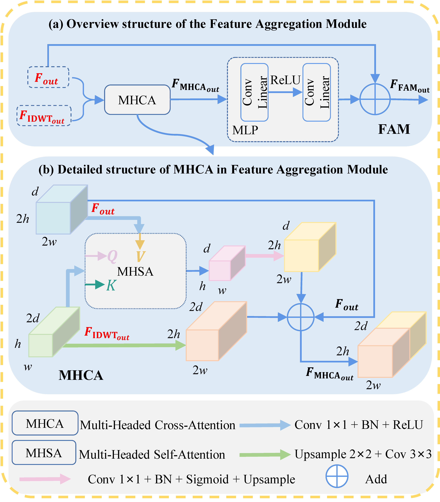

# WaveletFormer: A Transformer-based Wavelet Network for Real-world Non-homogeneous and Dense Fog Removal

>__Highlights:__ We propose the WaveletFormer and IWaveletFormer blocks to alleviate texture detail loss and maintain image resolution, combining the advantages of Vision Transformer and wavelet transform. The parallel convolution in the WaveletFormer and IWaveletFormer blocks captures the multi-frequency information in the lightweight mechanism, decreasing the network computational expenses.
>
>The feature aggregation module is proposed to capture the long-range multi-frequency information in the lightweight mechanism and further enhance the feature extraction capability of WaveletFormerNet.
>
>We present WaveletFormerNet, an end-to-end wavelet reconstruction network guided by frequency information to tackle image dehazing problems under complex, hazy conditions in the real world. To validate the effectiveness of WaveletFormerNet, we conducted extensive experiments on both synthetic and real-world datasets. The results demonstrate that our method yields competitive de-fogging performance in comparison to state-of-the-art methods.

* [Network Architecture](https://github.com/shengli666666/WaveletFormerNet/tree/main#network-architecture)
* [Dependencies and Installation](https://github.com/shengli666666/WaveletFormerNet/tree/main#dependencies-and-installation)
* [Datasets Preparation](https://github.com/shengli666666/WaveletFormerNet/tree/main#datasets-preparation)
    * [Synthetic Fog Dataset](https://github.com/shengli666666/WaveletFormerNet/tree/main#synthetic-fog-dataset)
    * [Real-world Fog Datasets](https://github.com/shengli666666/WaveletFormerNet/tree/main#real-world-fog-datasets)
    * [Real world Dust Dataset](https://github.com/shengli666666/WaveletFormerNet/tree/main#real-world-dust-dataset)
* [Quick Run](https://github.com/shengli666666/WaveletFormerNet/tree/main#quick-run)
* [Quantitative comparisons](https://github.com/shengli666666/WaveletFormerNet/tree/main#quantitative-comparisons)
    * [Comparison of referenced evaluation on real-world dehazing](https://github.com/shengli666666/WaveletFormerNet/tree/main#comparison-of-referenced-evaluation-on-real-world-dehazing)
    * [Comparison of non-referenced evaluation on real-world dehazing](https://github.com/shengli666666/WaveletFormerNet/tree/main#comparison-of-non-referenced-evaluation-on-real-world-dehazing)
    * [Comparison on synthetic dataset dehazing](https://github.com/shengli666666/WaveletFormerNet/tree/main#comparison-on-synthetic-dataset-dehazing)
    * [Parameters and Runtime Analysis](https://github.com/shengli666666/WaveletFormerNet/tree/main#parameters-and-runtime-analysis)
* [Qualitative Comparisons](https://github.com/shengli666666/WaveletFormerNet/tree/main#qualitative-comparisons)
    * [Comparisons on the on the natural hazy images and RTTS dataset](https://github.com/shengli666666/WaveletFormerNet/tree/main#comparisons-on-the-on-the-natural-hazy-images-and-rtts-dataset)
* [Generality Analysis for WaveletFormerNet](https://github.com/shengli666666/WaveletFormerNet/tree/main#generality-analysis-for-waveletformernet)
* [Application Test](https://github.com/shengli666666/WaveletFormerNet/tree/main#application-test)
* [Ablation Experiments](https://github.com/shengli666666/WaveletFormerNet/tree/main#ablation-experiments)

## Network Architecture

As we have uploaded a lot of pictures, the page may refresh slowly. Thank you very much for your patience!

### WaveletFormerNet Network

<center>
    
</center>

The schematic illustration of the proposed WaveletFormerNet. WaveletFormer block and IWaveletFormer block consist of DWT and IDWT and Transformer block respectively, and IDWT is the reverse process of DWT.

### WaveletFormer Block and Feature Aggregation Module

|||
|:-:|:-:|

## Dependencies and Installation

* python3.9
* PyTorch>=1.0.1
* NVIDIA GPU+CUDA>=11.4
* numpy
* matplotlib
* pytorch_wavelets

### Datasets Preparation

#### Synthetic Fog Dataset:

* Dataset: RESIDE; Paper: [RESIDE: A Benchmark for Single Image Dehazing](https://arxiv.org/pdf/1712.04143.pdf)

#### Real-world Fog Datasets:

* Dataset: I-HAZE; Paper: [I-HAZE: a dehazing benchmark with real hazy and haze-free indoor images](https://arxiv.org/pdf/1804.05091.pdf)
* Dataset: O-HAZE; Paper: [O-HAZE: a dehazing benchmark with real hazy and haze-free outdoor images](https://openaccess.thecvf.com/content_cvpr_2018_workshops/papers/w13/Ancuti_O-HAZE_A_Dehazing_CVPR_2018_paper.pdf)
* Dataset: DENSE; Paper: [Dense-Haze: a benchmark for image dehazing with dense-haze and haze-free images](https://arxiv.org/pdf/1904.02904.pdf)
* Dataset: NHHAZE; Paper: [NTIRE 2020 NonHomogeneous Dehazing Challenge (2020)](https://competitions.codalab.org/competitions/22236)
* Dataset: Natural hazy images dataset; Paper: [Dehazing Using Color-Lines](https://www.cs.huji.ac.il/w~raananf/projects/dehaze_cl/results/#stadium)
* Dataset: RTTS dataset: [We have placed this dataset in the link](https://drive.google.com/file/d/1v_yQ69qgAjdD99GgN_MFv3CfIOQcnkex/view?usp=drive_link)

<details>
<summary> FILE STRUCTURE (click to expand) </summary>

```
    DWT-ViT
    |-- README.md
    |-- datasets
        |-- RESIDE
            |-- ITS
                |-- hazy
                    |-- *.png
                |-- clear
                    |-- *.png
            |-- OTS 
                |-- hazy
                    |-- *.jpg
                |-- clear
                    |-- *.jpg
            |-- SOTS
                |-- indoor
                    |-- hazy
                        |-- *.png
                    |-- clear
                        |-- *.png
                |-- outdoor
                    |-- hazy
                        |-- *.jpg
                    |-- clear
                        |-- *.png
        |--RealWorld
            |-- dense
                |-- hazy
                    |-- *.png
                |-- clear
                    |-- *.png
            |-- nhhaze
                |-- hazy
                    |-- *.png
                |-- clear
                    |-- *.png
            |-- ihaze
                |-- hazy
                    |-- *.jpg
                |-- clear
                    |-- *.jpg
            |-- ohaze
                |-- hazy
                    |-- *.jpg
                |-- clear
                    |-- *.jpg
```
</details>

### Real world Dust Dataset:

* Dataset: RB-Dust; Paper: [RB-Dust – A Reference-based Dataset for Vision-based Dust Removal](https://arxiv.org/pdf/2306.07244.pdf) [dataset link](www.agriscapes-dataset.com)

## Quick Run

Before you start your experiment, please follow the [instructions](https://www.cnblogs.com/wanghui-garcia/p/12526298.html) to install pytorch-wavelets.

Trained_models will be available.

For your quick run, we have selected a small number of hazy images in the `./datasets/hazy` folder.

* Put  models in the `./trained_models/` folder.*

* Trained_models are available at [google drive](https://drive.google.com/drive/folders/1whYayNFJsXgKgErAMeBPSsOfishFkpw_?usp=drive_link) 

To test the pre-trained models of Dense-Haze, Ihaze, Ohaze, and NHHaze on your own images, run:
```shell
python test.py --task Task_Name --input_dir path_to_images
```
Here is an example to perform NH-Haze:

```shell
python test.py --task nhhaze --input_dir datasets/hazy
```
* Check out the test results in the `./dwtformer_nhhaze` folder.*

We have put more experimental results  in the `./results/` folder. 

* `overhead.py` is a file where you can test network model's parameters (Params), multiply-accumulate operations (MACs), and inference time.

To train the model on your way, run:

```shell
python main.py 
```
*Go to `./models/data_utils.py` and `./models/option.py` to adjust the hyperparameters as well as the training details.

## Quantitative comparisons

We have uploaded the MATLAB versions of the three non-referenced indicators (**`FADE.m`**, **`NIQE.m`**, **`Entropy.m`**) used in our papaer at `./metrics/` folder.

A higher Entropy score indicates that the image presents more detail, a lower NIQE score indicates better image quality, while a lower FADE score indicates better visibility.

### Comparison of referenced evaluation on real-world dehazing

<center>
    
</center>

### Comparison of non-referenced evaluation on real-world dehazing

<center>
    
</center>

### Comparison on synthetic dataset dehazing

<center>
    
</center>

### Parameters and Runtime Analysis

<center>
    
</center>

We conduct parameters (# Param), floating-point operations (# FLOPs), and inference time as the main metrics of computational efficiency on RGB image with a resolution of 256 × 256 between WaveletFormerNet and SOTA methods.

## Qualitative Comparisons

<center>


</center>

## Comparisons on the on the natural hazy images and RTTS dataset

<center>
    
</center>

<center>
    
</center>
    
* More dehazed results are available in the `./results/` folder.

## Generality Analysis for WaveletFormerNet
<center>
    
</center>

WaveletFormerNet also achieves satisfactory results on the agricultural landscape dust dataset (RB-Dust dataset) compared to SOTA methods in extension experiments, demonstrating the promising robustness and better generalization ability of WaveletFormerNet.

## Application Test

We perform a feature point matching test to evaluate the performance of WaveletFormerNet.

<center>

</center>

## Ablation Experiments

### Quantitative and Visualization comparison of ablation experiments

|||
|:-:|:-:|

## Citation

If our work can bring you help, we will be very excited! If you have other questions, please contact the Authors (e-mail at zhangshengli_win@163.com). We look forward to your valuable suggestions, your comments will make our work better!


  
 
